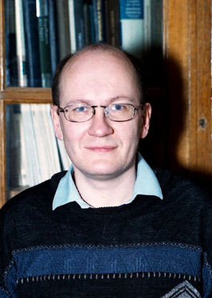
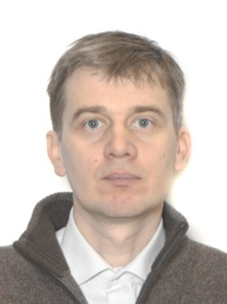

- **[Шафаревич Андрей Игоревич](#01)**
  - Программа кандидата: [Программа А. И. Шафаревича.pdf](public/Программа_А._И._Шафаревича.pdf) 
- **[Бородин Пётр Анатольевич](#02)**
  - Программа кандидата: [Программа П. А. Бородина.pdf](public/Программа_П._А._Бородина.pdf) 

---

## Шафаревич Андрей Игоревич

> 
> 
> #### Выпускник физфака МГУ
> Окончил специалитет на кафедре математики в 1987 году, аспирантуру — в 1990 году
> 
> #### Доктор физико-математических наук
> Защитил диссертацию в 1999 году
> 
> #### Профессор кафедры дифференциальной геометрии и приложений мехмата МГУ
> Работает на кафедре с 1994 года, в должности профессора — с 2002 года
> 
> #### Заместитель декана мехмата МГУ по научной работе
> Работает в должности с 2016 года, входит в методический совет факультета
> 
> #### Учёный секретарь диссертационного совета МГУ.01.17
> Входит в состав совета и является его учёным секретарём с 2015 года
> 
> #### Член-корреспондент Российской академии наук
> Выбран отделением математических наук в 2016 году
> 
> Научные интересы — математическая физика, асимптотическая и геометрическая теория линейных и нелинейных уравнений в частных производных, квантовая механика и гидродинамика. На мехмате преподаёт классическую дифференциальную геометрию, дифференциальную геометрию и топологию, наглядную геометрию и топологию; ведёт спецкурс и спецсеминар. Также преподаёт в МФТИ. Ранее преподавал в московских школах и работал в качестве приглашённого профессора в университетах Мексики, Германии и Франции. Руководитель и участник российских и зарубежных грантов.
> 
> _Подробнее: [сайт кафедры](http://dfgm.math.msu.su/people/shafarevich/index.php), [Math-Net.Ru](http://www.mathnet.ru/rus/person19097), [ИСТИНА](https://istina.msu.ru/profile/shafar/), [РАН](http://www.ras.ru/win/db/show_per.asp?P=.id-64110.ln-ru), [Википедия](https://ru.wikipedia.org/wiki/%D0%A8%D0%B0%D1%84%D0%B0%D1%80%D0%B5%D0%B2%D0%B8%D1%87,_%D0%90%D0%BD%D0%B4%D1%80%D0%B5%D0%B9_%D0%98%D0%B3%D0%BE%D1%80%D0%B5%D0%B2%D0%B8%D1%87)_

[↑ Наверх](#Кандидаты)

## Бородин Пётр Анатольевич

>
>
> #### Выпускник мехмата МГУ
> Окончил специалитет в 1994 году, аспирантуру — в 1998 году
> 
> #### Доктор физико-математических наук
> Защитил диссертацию в 2012 году
> 
> #### Профессор кафедры теории функций и функционального анализа мехмата МГУ
> Работает на кафедре с 1998 года, в должности доцента — с 2001 по 2015 год, в должности профессора — с 2015 года
> 
> #### Профессор Российской академии наук
> Выбран отделением математических наук и вошёл в координационный совет профессоров РАН в 2018 году
> 
> Работал заместителем декана мехмата МГУ по новому приёму с 1999 по 2004 год. Научные интересы — теория приближений и геометрия банаховых пространств. На мехмате преподаёт комплексный и функциональный анализ, ведёт спецкурс и спецсеминар. Также преподаёт на географическом факультете, в СУНЦ и классах при мехмате школы № 54, участвует в составлении задач для школьных математических олимпиад.
> 
> _Подробнее: [сайт кафедры](http://new.math.msu.su/tffa/persons/borodin.html), [Math-Net.Ru](http://www.mathnet.ru/rus/person8531), [ИСТИНА](https://istina.msu.ru/profile/BorodinPA/), [РАН](http://www.ras.ru/win/db/show_per.asp?P=.id-65077.ln-ru)_

[↑ Наверх](#Кандидаты)
